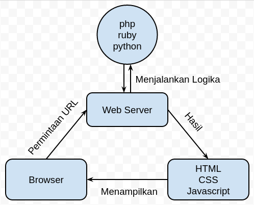

Belajar tentang Pemetaan Online
===========

Kenapa membuat ini? karena terinspirasi https://github.com/tmcw/mapmakers-cheatsheet .

# Pengantar

Pemetaan online kini makin banyak digunakan. 

# Konsep Peta

# Konsep Website
Konsep dasar website adalah kumpulan halaman yang menampilkan informasi bisa berupa teks, gambar, animasi, suara, video atau gabungan dari semuanya, baik yang bersifat statis maupun dinamis yang membentuk satu rangkaian yang saling terkait dimana masing-masing dihubungkan dengan jaringan-jaringan halaman (hyperlink).
Selanjutnya cara kerja website itu adalah berawal dari client yang memanggil berdasarkan URL (Uniform Resource Locator) melalui browser, kemudian web server melakukan perintahnya berdasarkan algoritma yang sudah dibuat dengan menggunakan bahasa [PHP](https://www.php.net), [Ruby](https://www.ruby-lang.org), [Python](https://www.python.org) atau bahasa pemrograman server lainnya. Setelah selesai selanjutnya hasil informasi segera diterjemahkan pada kode [HTML](https://en.wikipedia.org/wiki/HTML), [CSS](https://en.wikipedia.org/wiki/Cascading_Style_Sheets), [JavaScript](https://en.wikipedia.org/wiki/JavaScript) atau bahasa pemrograman client lainnya untuk ditampilkan ke layar browser kembali.

# Konsep Pemetaan Online